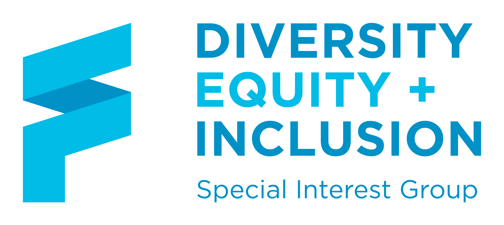

# Diversity Equity & Inclusion Special Interest Group

## FINOS DEI SIG Overview

Since first launching in 2022, FINOS’ DEI SIG has achieved strong momentum encouraging the participation of underrepresented groups and delivering keynote panels at [OSFF](https://events.linuxfoundation.org/open-source-finance-forum/); running federated events within the FINOS community and sharing best practice on open source in financial services with diverse communities such as [Anita B’s Grace Hopper Celebration](https://ghc.anitab.org/).

More recently, the DEI SIG has worked to deepen its breadth and impact to make it part of our DNA and legacy. In 2024, we set further goals to create expanded SIG leadership and contributor opportunities; agree on priorities to develop, advance, and retain diverse talent; ensure FINOS projects are inclusive and events are diverse. 

Key focus areas for the year included Accessibility;[advancing Responsible AI; Diversity & Open Source Talent Development as Key Pillars for Inclusive Technology](https://www.finos.org/blog/finos-dei-sig-advances-responsible-ai).

## 2025 Plans

Moving forward, the work of the DEI committee will continue to complement the work of [FINOS’ Open Source Readiness (OSR) SIG](https://www.finos.org/blog/open-source-readiness) to attract and empower a diverse talent pool in Financial Services Open Source that changes the status quo and drives a better future. 

For 2025, we plan to launch a community event series for folks from underrepresented backgrounds and those who would like to support and champion them & drive meaningful change. Formats will focus on:
- Knowledge transfer
- Subject matter expertise
- Best practices
- Networking for driving inclusion and talent development in the FINOS community.

## Co-Chairs (2024)
- **Rita Chaturvedi** - Morgan Stanley (rita.chaturvedi@morganstanley.com)
- **Sérgio Bettencourt** - Citi (sergio.bettencourt@citi.com)
- **Paula Paul** - Greyshore Associates (@paulapaul paula@greyshore.com)

**FINOS Lead:** Rimma Perelmuter (Rimma@finos.org)

---

## Meetings

Join our next [DEI SIG meetings](https://calendar.google.com/calendar/event?action=TEMPLATE&tmeid=dmR0N3NsbmMyNmMza2UxNTM2NDg1MjBzamVfMjAyNDAzMDZUMTcwMDAwWiBmaW5vcy5vcmdfZmFjOG1vMXJmYzZlaHNjZzBkODBmaThqaWdAZw&tmsrc=finos.org_fac8mo1rfc6ehscg0d80fi8jig%40group.calendar.google.com) to contribute and collaborate on our expanded Vision! 

## DEI SIG 2024 Goals

- Create opportunities to develop, advance and retain diverse talent
- Ensuring our projects are inclusive - meet the needs of the underrepresented
- Events are diverse

## License

Copyright 2022 FINOS

Distributed under the [Apache License, Version 2.0](http://www.apache.org/licenses/LICENSE-2.0).

SPDX-License-Identifier: [Apache-2.0](https://spdx.org/licenses/Apache-2.0)

