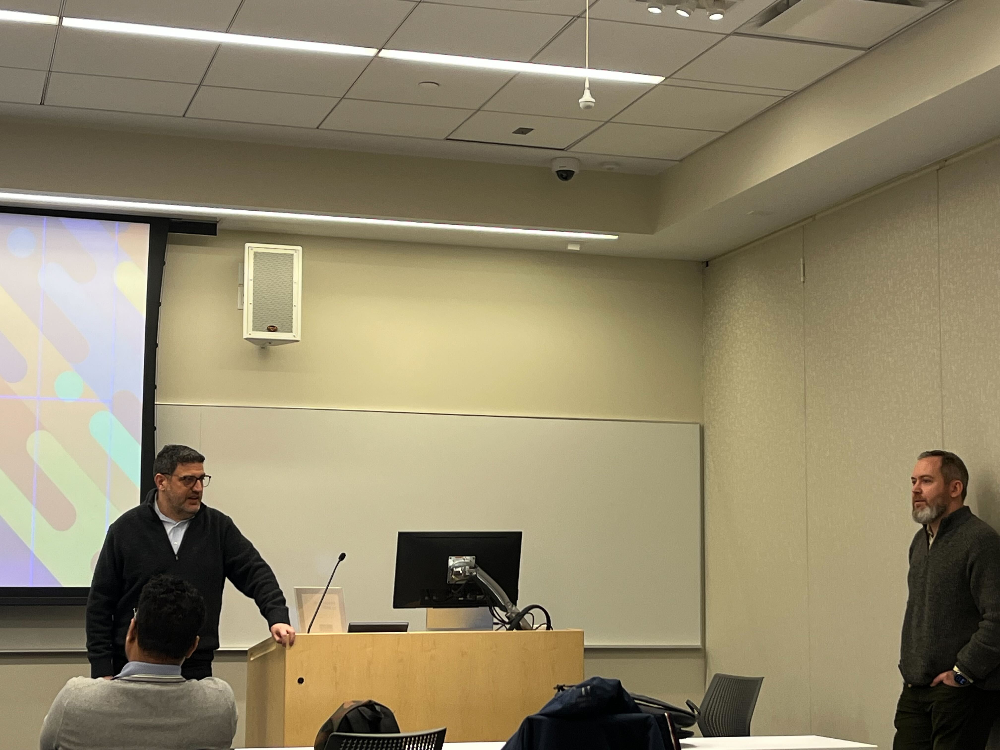
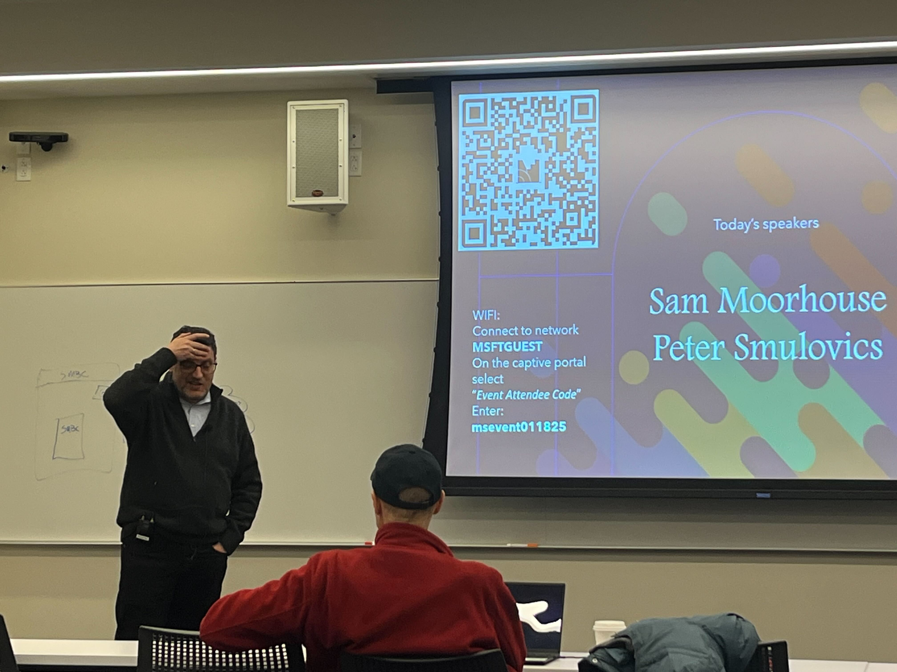
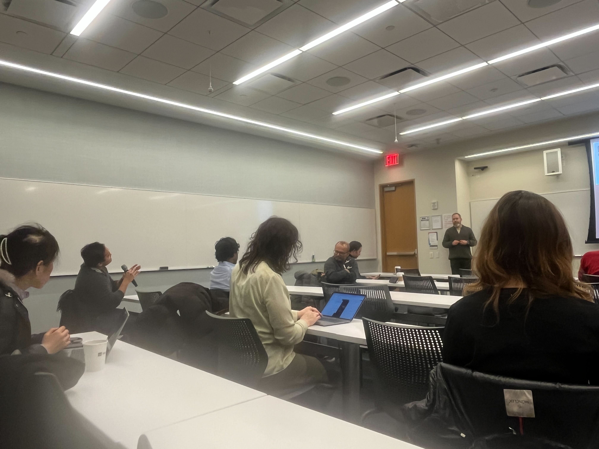

# FINOS Empowers - The Inclusion Collective - 2025, January 22

The first session of the new series from the DEI SIG, the FINOS Empowers - The Inclusion Collective series, was a big success in the heart of New York, hosted by FINOS member company Microsoft. The event, supported by FINOS, brought together people interested in what belonging to a community can help you with. We had lively mingling before and after the discussion between Sam Moorhouse and Peter Smulovics. Check [this](https://www.linkedin.com/pulse/finos-empowers-power-community-benefits-life-work-peter-smulovics-ttbue/) out for a LinkedIn post about the event!

_Pictures courtesy of Eteri Dvalishvili_

